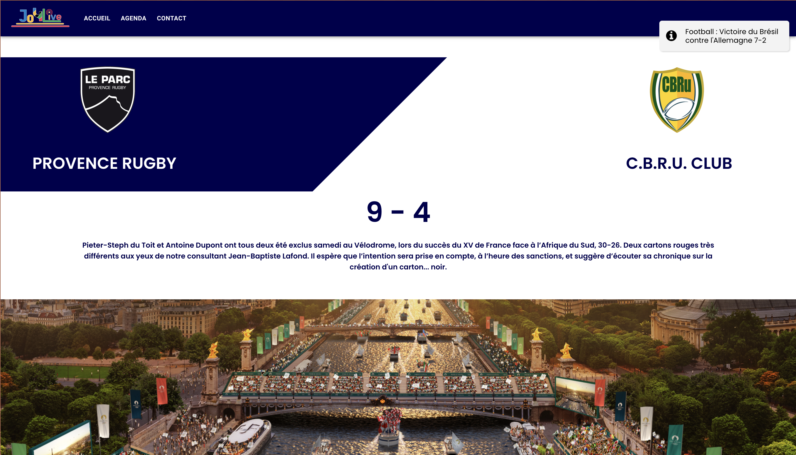
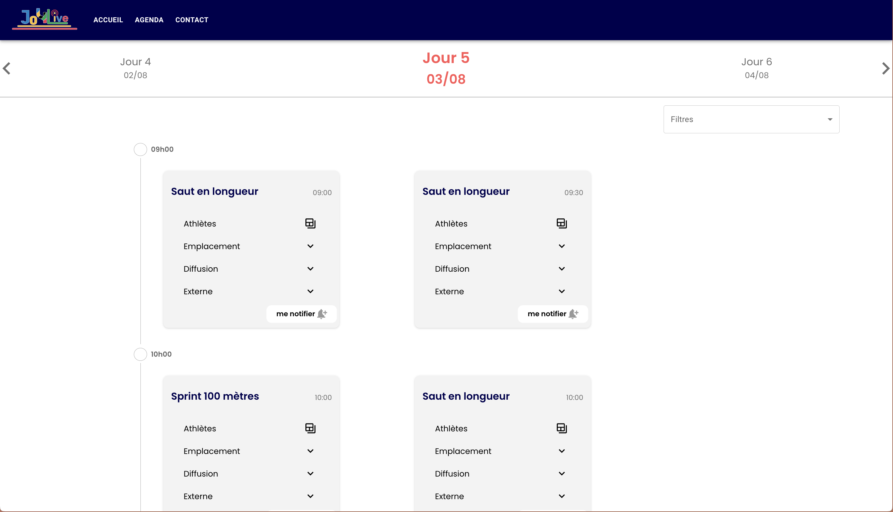
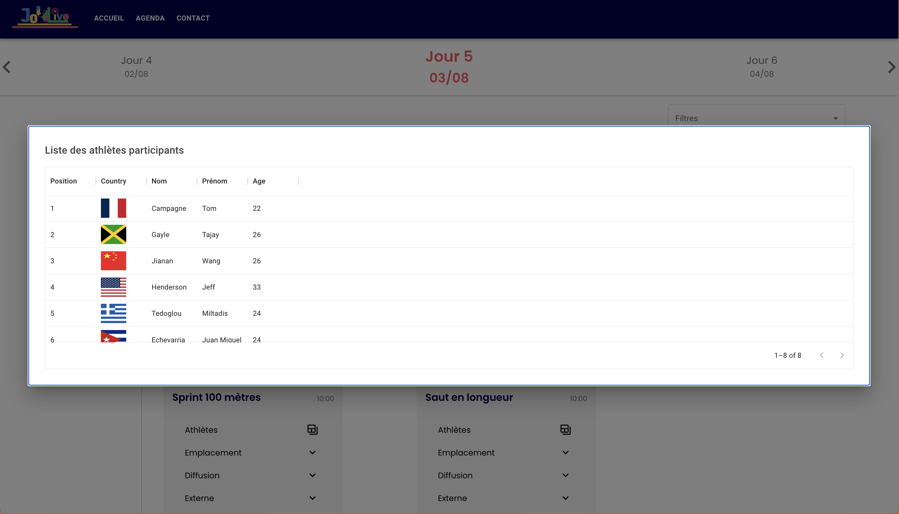

# Hackathon Voyage Privé

## 📸 Screenshots
<!-- Add your screenshots here -->





## 🚀 About the Project
This project is a web application developed for the Voyage Privé Hackathon. The project was coded in 2 days on the "Voyage Privé" website in Aix-en-Provence.

## 🏗️ Architecture
The application is built with the following technologies:
- **Frontend**: React.js
- **Containerization**: Docker
- **Web Server**: Nginx

### Project Structure
```
.
├── front/               # React Application
│   ├── src/            # React Source Code
│   ├── public/         # Static Files
│   ├── Dockerfile      # Docker Configuration
│   └── nginx.conf      # Nginx Configuration
└── Makefile           # Automation Scripts
```

## 🛠️ Installation and Setup

### Prerequisites
- Node.js (v14 or higher)
- npm or yarn
- Docker (optional)
- Make

### Installation
1. Clone the repository:
```bash
git clone [REPO_URL]
cd Hackathon-Voyage-Prive
```

2. Install dependencies:
```bash
make install
```

### Running the Application

#### Development Mode
```bash
make dev
```
The application will be available at: http://localhost:3000

#### Production Mode
```bash
make build
make start
```
The application will be available at: http://localhost:80
